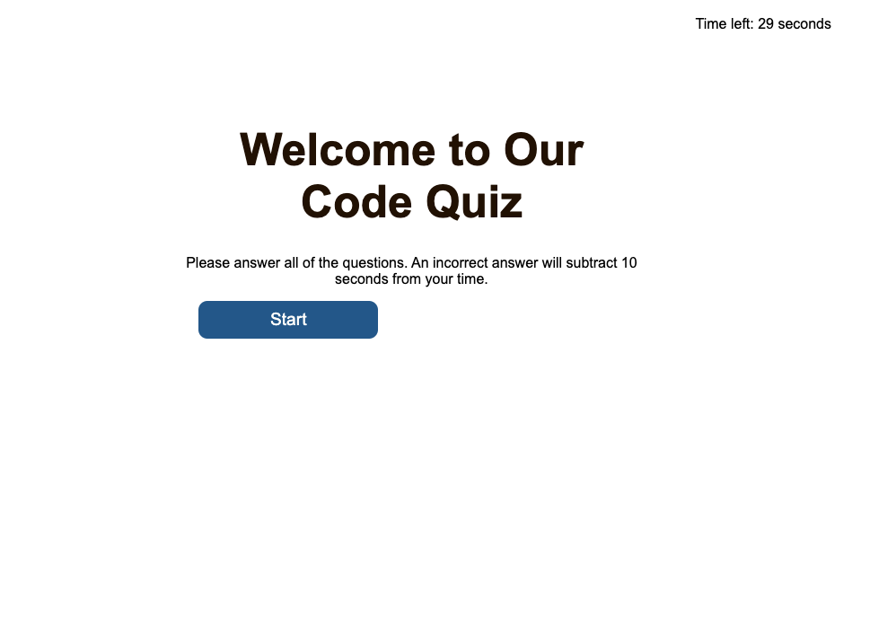

# code-quiz
## Code Quiz Generator
* When the user presses the start quiz button the timer starts
* The quiz takes the user through a series of questions
* After each correct question the user is told they chose the correct answer
* After each wrong answer, the user is told they chose the wrong answer and their score is reduced by 10 seconds.
* After each question the user is presented with another question
* If time has run out then the game is over
* The user is prompted to store their name for the winner list

## Enhancements to be made
* Local Storage needs to be improved
* A proper winners board needs to be implemented
* Improve sound effects

